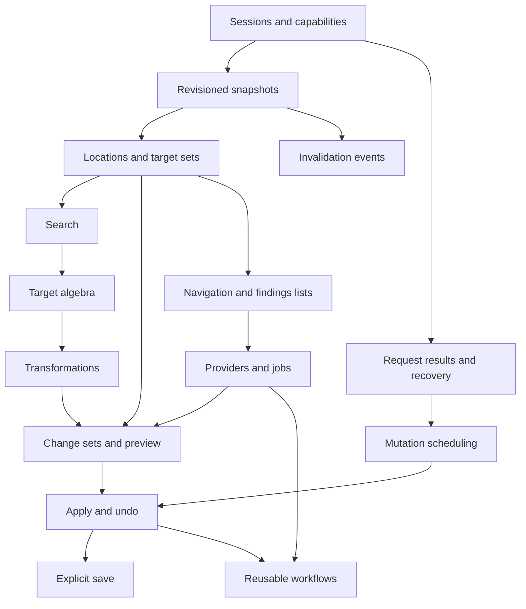

# Dependency roadmap and acceptance gates

## Product defaults

- Vim9 script, Vim 9.0.0000+, macOS/Linux; no Neovim layer.
- Build shared representations before specialized workflows.
- Live buffers are authoritative for unsaved content; saving is explicit.
- Node hosts MCP/protocol/project operations; Vim owns editor state and mutation.
- Structured editing is the default path; unrestricted Ex/macros/providers have distinct guarantees.

The [feature catalog](feature-catalog.md) is the inventory. The [capability contract](capabilities.md) defines public behavior. Tool input schemas live in `src/schema.js` and are exposed by MCP discovery.

## Dependency order

## Gates

### Foundation gate — dependable addressing and execution

Implement F1–F5. Acceptance: independent editor sessions, lifecycle-sensitive IDs, bounded live reads, actual results, cross-client request deduplication, late reply tracking, disconnect outcomes, and queued cancellation. No mutation is replayed automatically.

Tests: broker socket tests, target/schema tests, headless Vim integration, and real-terminal interaction. Terminal interaction verifies Insert-mode deferral, cancellation, two simultaneous editors, and session invalidation on reconnect.

### Editing gate — one complete useful loop

Implement C1–C7. Acceptance: capture/read → search → preview → apply → verify → undo. Verify:

- Preparation leaves text unchanged and returns a reviewable diff.
- Stale reads/previews and changed undo history reject dependent mutations.
- Agent undo boundaries remain independent of user typing.
- Multi-line insertions/deletions, Unicode byte boundaries, empty/unnamed/hidden buffers work.
- Applying in the background preserves a displayed diff scratch buffer and user registers.
- Existing quickfix history survives publication; navigation returns to the prior view.
- Saving checks disk conflicts, read-only state, and current revisions.

### Composition gate — more producers and consumers

Implement W1–W8. Acceptance: target algebra, live-over-disk project search, substitution through standard change sets, hunk application, invalidation cursors, provider input validation, and job output converted into findings. Provider-dependent capabilities advertise only configured providers. Disk-based jobs do not claim to analyze unsaved text.

### Extension gate — reusable user-specific workflows

Implement E1–E6. Acceptance: user-registered functions, discoverable editor setup/help, macro storage separate from execution, actual Ex errors/output, non-forcing workspace operations, named recipes with prior-result references, and stop-on-failure results.

## Verification and rollout

`npm test` uses temporary isolated runtimes and no user vimrc. Integration is tested through both the private broker protocol and the official MCP client. Python supplies a real PTY for interactive tests. `VIM=/path/to/vim npm test` exercises another supported build.

The CI matrix builds tagged Vim 9.0.0000 and tests a current packaged Vim on Linux, plus the system Vim on macOS. Local validation includes the minimum release and the available Vim 9.1 build. No migration is required: installation is additive through Vim's runtime path and a client MCP command.

Review limits and unsupported features in the README before expanding the claimed support matrix. Keep feature status, tool schemas, and documentation synchronized as capabilities change. A failing gate blocks publishing a release that claims the corresponding behavior; packaging a release or publishing to a registry is a separate explicit action.
